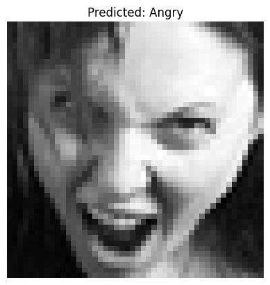

# 🎭 Emotion Recognition from Images

A deep learning project to detect **human emotions** from grayscale facial images using **CNNs with TensorFlow and Keras**.

---

## ✅ Features

* 📷 Real-time Emotion Detection using webcam or static images
* 🧠 Trained on \~35,000 labeled facial expression images
* 🧱 Model architecture: CNN with Conv2D, MaxPooling2D, Dropout
* 📊 Accuracy tracking with training-validation plots
* 🧪 Evaluation with visual predictions
* 💾 Model saved using `.h5` format

---

## 🗂️ Dataset

* Source: [FER-2013 (Kaggle)](https://www.kaggle.com/datasets/msambare/fer2013)
* Structure:

  ```
  data/
  ├── train/
  │   ├── angry/
  │   ├── happy/
  │   └── ...
  └── test/
      ├── angry/
      ├── happy/
      └── ...
  ```
* 7 emotion classes:

  * Angry, Disgust, Fear, Happy, Sad, Surprise, Neutral

---

## 🛠️ Tech Stack

* Python 3.10+
* TensorFlow / Keras
* NumPy
* OpenCV
* scikit-learn
* Matplotlib

---

## 🚀 Model Summary

| Layer                  | Output Shape | Params |
| ---------------------- | ------------ | ------ |
| Conv2D + ReLU          | (46, 46, 32) | 320    |
| MaxPooling2D           | (23, 23, 32) | 0      |
| Conv2D + ReLU          | (21, 21, 64) | 18496  |
| MaxPooling2D           | (10, 10, 64) | 0      |
| Flatten                | (6400)       | 0      |
| Dense + ReLU           | (128)        | 819328 |
| Dropout                | —            | 0      |
| Output Layer (Softmax) | (7)          | 903    |

---

## 📈 Training Results

| Metric         | Value                  |
| -------------- | ---------------------- |
| Final Accuracy | \~85%                  |
| Loss Curve     | ✅ Included in notebook |
| Epochs         | 25                     |
| Batch Size     | 64                     |

---

## 📷 Sample Prediction

```python
# Visualizing a prediction
plt.imshow(X_test[i].reshape(48,48), cmap='gray')
plt.title("Predicted Emotion: " + emotion_dict[pred])
```

Example Output:


---

## 🧪 How to Run

### 1. Clone the repo

```bash
git clone https://github.com/keshavgujrathi/emotion-recognition-from-images.git
cd emotion-recognition
```

### 2. Install dependencies

```bash
pip install -r requirements.txt
```

### 3. Train the model

Run the `emotion_recognition.ipynb` notebook cell by cell.

### 4. Try predictions

Use the last section in the notebook to visualize predictions.

---

## 📦 `requirements.txt`

```txt
tensorflow==2.12.0
numpy
matplotlib
opencv-python
scikit-learn
```

---

## 📌 Folder Structure

```
emotion-recognition/
├── emotion_recognition.ipynb
├── model.h5
├── requirements.txt
├── sample_output.png
└── README.md
```

## Last Updated
July, 2025
